## [PYTHON] Linear Regression

Thuật toán hồi quy tuyến tính với 2 phương pháp giải chính xác phương
trình và phương pháp suy giảm độ dốc để tìm ra phương trình hồi quy. Hai
phương pháp này đều có ưu và nhược điểm riêng.

|                 |                                                                                                          |                                                                                                                         |
|-----------------|----------------------------------------------------------------------------------------------------------|-------------------------------------------------------------------------------------------------------------------------|
| **Phương pháp** | **Normal Equation Linear Regression**                                                                    | **Gadient Descent Linear Regression**                                                                                   |
| **Ưu điểm**     | Tìm ra nghiệm tối ưu toàn cục mà không cần lặp, vì đây là giải pháp đóng.                                | Phù hợp với tập dữ liệu lớn (n lớn) hoặc số đặc trưng lớn (p lớn), vì không cần tính toán nghịch đảo ma trận.           |
|                 | Không cần chọn learning rate hay số lần lặp như gradient descent.                                        | Có thể áp dụng cho các bài toán không có nghiệm đóng hoặc các mô hình phức tạp hơn như hồi quy phi tuyến.               |
|                 | Phù hợp khi số lượng mẫu (n) và số đặc trưng (p) nhỏ, vì tính toán ma trận đơn giản.                     | Chỉ cần lưu trữ gradient và tham số tại mỗi bước lặp, không cần lưu ma trận lớn.                                        |
| **Nhược điểm**  | Yêu cầu tính toán nghịch đảo ma trận, có độ phức tạp O(p^3), không khả thi với số đặc trưng lớn (p lớn). | Cần điều chỉnh learning rate, số lần lặp, hoặc các tham số khác. Chọn sai có thể dẫn đến hội tụ chậm hoặc không hội tụ. |
|                 | Khi số lượng mẫu (n) hoặc đặc trưng (p) lớn, việc tính toán trở nên tốn kém về bộ nhớ và thời gian.      | Có thể bị kẹt ở cực tiểu địa phương dù hiếm trong hồi quy tuyến tính vì hàm mất mát là lồi.                             |

## Dưới đây là quá trình giải

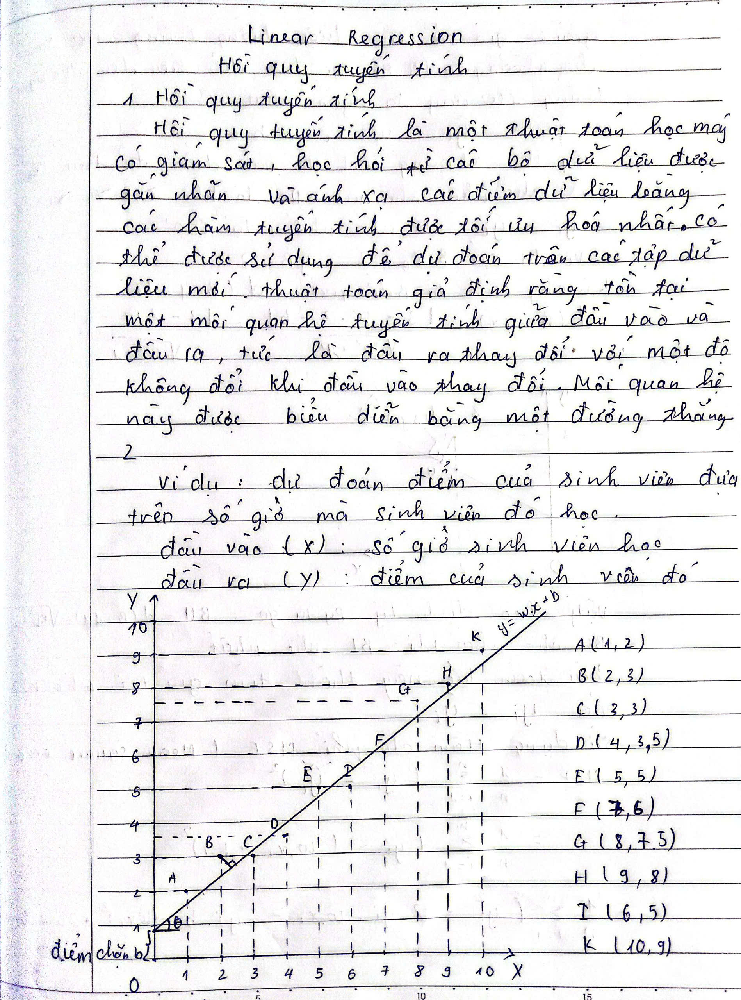

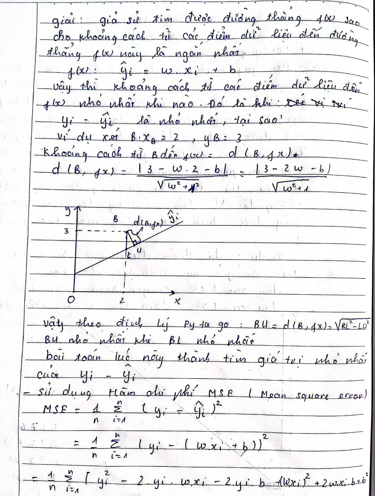

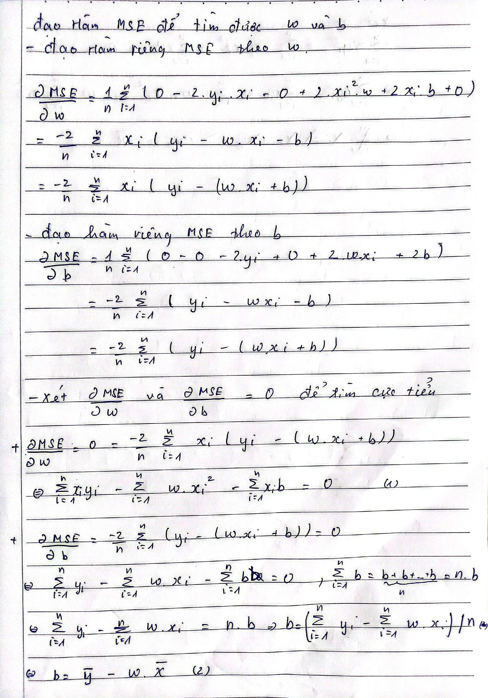

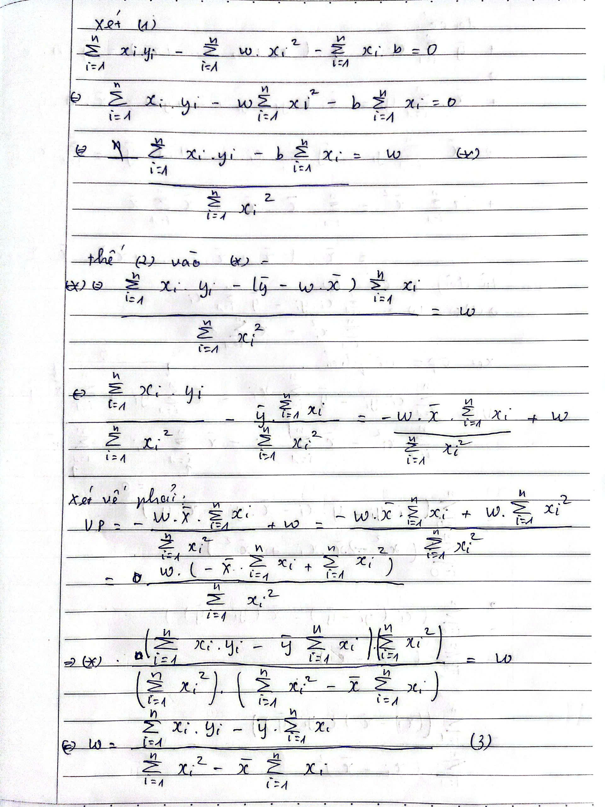

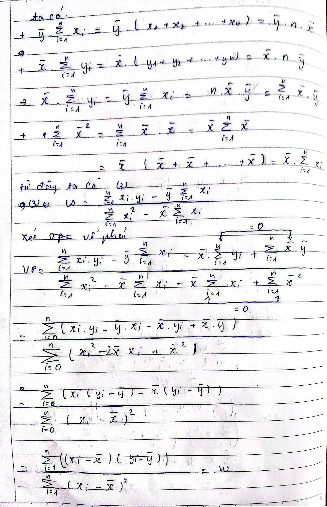

## Test
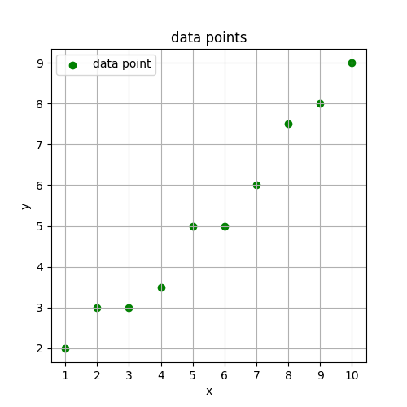

*Dữ liệu kiểm thử*

Kiểm tra với dữ liệu kiểm thử phương trình fx được tính toán kết quả như
thế nào và dự đoán cho một điểm chưa có trong dữ liệu huấn luyện x=5.5 .

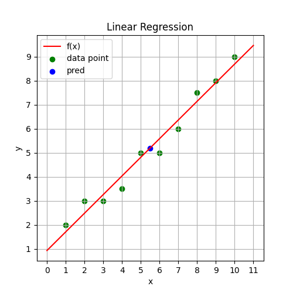

*Kết quả với Normal Equation Linear Regression*

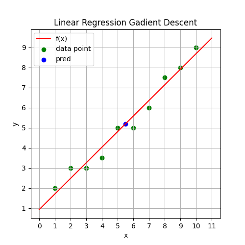

*Kết quả với Gadient Descent Linear Regression*

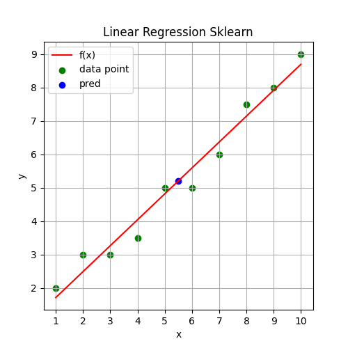

Kết quả với Linear Regression sử dụng Scikit-learn

*Kết quả dự đoán*

Kiểm thử với bộ dữ liệu 700 sample.

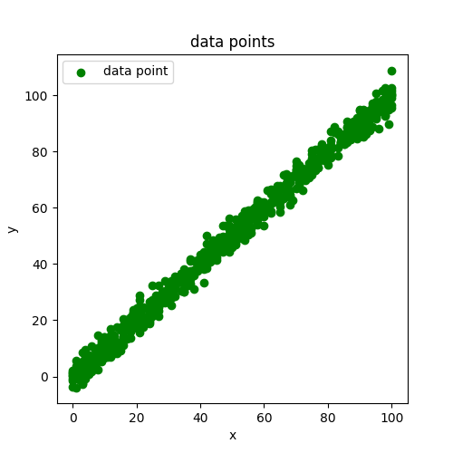

*Dữ liệu kiểm thử*

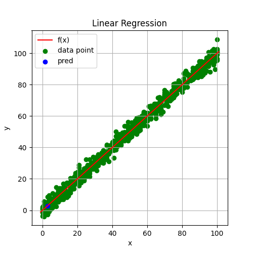

*Kết quả với Normal Equation Linear Regression*

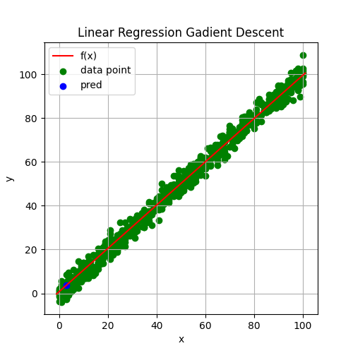

*Kết quả với Gadient Descent Linear Regression*

Với phương pháp **Gadient Descent Linear Regression** cần phải lựa chọn
bộ siêu tham số sao cho nó có thể tìm được đường thẳng tối ưu và tránh
bị tràn số.
